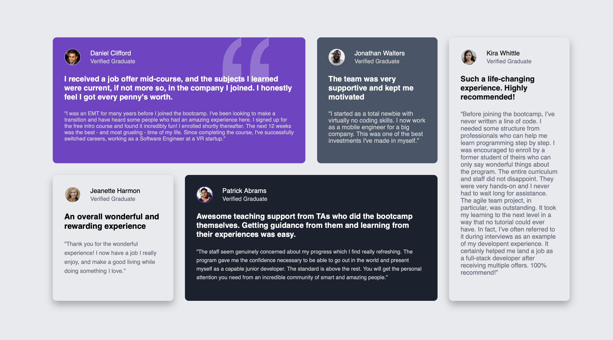

## Table of contents
- [Overview](#overview)
  - [Screenshot](#screenshot)
  - [Links](#links)
- [My process](#my-process)
  - [Built with](#built-with)
- [Author](#author)

## Overview

### Screenshot

### Links
- Solution URL: [GitHub Repository](https://github.com/Lodin03/testimonial-grid)
- Live Site URL: [Live Preview](https://lodin03.github.io/testimonial-grid/)

## My process

### Built with
- Semantic HTML5 markup
- SCSS (Sass) with nesting and variables  
- CSS Grid 
- Mobile-first workflow
- Responsive design principles (e.g. clamp() for fluid typography)
- Custom media queries
- BEM naming convention

## Author

- GitHub - [Lodin03](https://github.com/Lodin03)
- LinkedIn - [Lars Odin Tveit Moen](https://www.linkedin.com/in/lars-odin-tveit-moen-736600260/)
